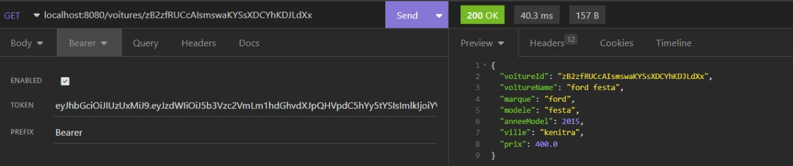

<h1>app-rent-a-car-spring-boot-react-fullstack</h1>

<h3>Technologies<h3>

OpenJdk 1.8
Apache Maven 9.0.68 
Spring boot 2.7.5
Mysql DB  

<h3>Spring Boot JAVA CRUD Restful API Endpoints</h3>

<h3> Gestion des Utilisateures </h3>

<h4> creer un utilisateur loueur  </h4>

<h4> modifier un utilisateur loueur </h4>

<h4> supprimer un utilisateur loueur par un utlisateur admnistarteur </h4>

<h4> lister les utilisateurs loueurs par un utlisateur admnistarteur  </h4>

<h4> authentifier un utilisateur et generer le token </h4>

<h4> récuperer un utilisateur loueur par ID </h4>

//////////////////////////////////
<h3> Gestion des Voitures </h3>

<h4> crer une annonce par un loueur </h4>

<h4> lister les annones par un utilisateur loueur  </h4>

<h4> lister les annones sont classées de la moins chère à la plus chère pour un utilisateur Locataire  </h4>

<h4> lister les utilisateurs de la plateforme  pour l'adminstarteur  </h4>

<h4> modifier une annonce par un loueur </h4>

<h4> récuperer une annonce par ID de voiture </h4>

<h3> importer fichier et telecharger (photo de voiture ) </h3>

<h4>importer fichier </h4>

<h4>telecharger fichier </h4>

